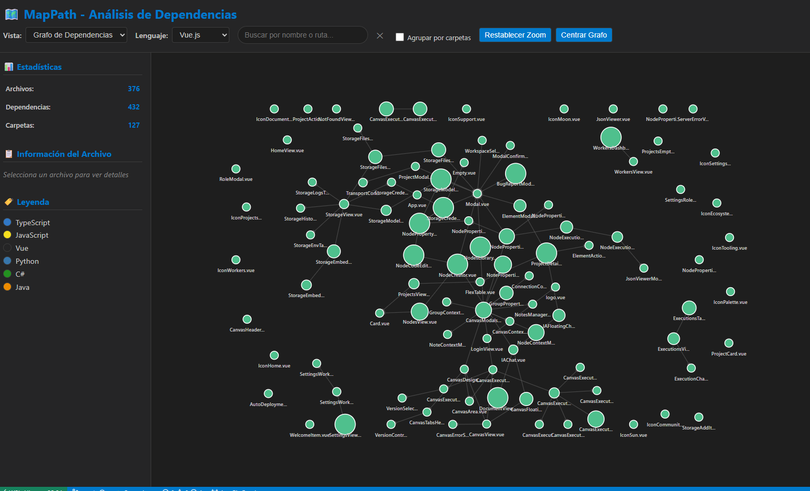

# MapPath - Visual Dependency Analyzer

[](https://marketplace.visualstudio.com/items?itemName=dinnger.mappath)

MapPath es una extensión de Visual Studio Code que analiza y visualiza las dependencias de tu proyecto en un grafo interactivo, organizando los archivos por carpetas y mostrando las relaciones entre ellos.



## 🚀 Características

- **Análisis Multi-lenguaje**: Soporte para TypeScript, JavaScript, Python, C#, Java y más
- **Visualización Interactiva**: Grafo de dependencias navegable con D3.js
- **Organización por Carpetas**: Agrupa archivos por estructura de directorios
- **Información Detallada**: Muestra dependencias, exportaciones y estadísticas de archivos
- **Filtros Inteligentes**: Filtra por lenguaje de programación
- **Múltiples Vistas**: Grafo de dependencias, árbol de archivos y vista por carpetas

## 📦 Instalación

1. Abre Visual Studio Code
2. Ve a la vista de Extensiones (`Ctrl+Shift+X`)
3. Busca "MapPath"
4. Haz clic en "Instalar"

## 🎯 Uso

1. Abre un proyecto en VS Code
2. Abre la Paleta de Comandos (`Ctrl+Shift+P`)
3. Ejecuta el comando: `MapPath: Analizar proyecto`
4. ¡Explora las dependencias de tu proyecto!

## 🗺️ Características del Visor

### Vista de Grafo de Dependencias
- Nodos representan archivos
- Aristas muestran dependencias
- Colores diferenciados por lenguaje
- Zoom y pan interactivos
- Tooltip con información detallada

### Vista por Carpetas
- Organización visual por estructura de directorios
- Fácil navegación entre módulos
- Comprensión rápida de la arquitectura

### Panel de Información
- Estadísticas del proyecto
- Detalles del archivo seleccionado
- Lista de dependencias y exportaciones
- Leyenda de colores por lenguaje

## 🔧 Lenguajes Soportados

| Lenguaje | Extensiones | Características |
|----------|-------------|-----------------|
| TypeScript | `.ts`, `.tsx` | Imports, exports, interfaces, clases, path aliases |
| JavaScript | `.js`, `.jsx`, `.mjs`, `.cjs` | Requires, imports, exports |
| Vue.js | `.vue` | Imports, components, Vite aliases |
| Python | `.py`, `.pyw` | Imports, from imports, `__all__` |
| C# | `.cs` | **Namespaces**, using statements, clases públicas |
| Java | `.java` | **Packages**, import statements, clases públicas |

### Resolución de Dependencias por Lenguaje

**TypeScript/JavaScript/Vue:**
- Rutas relativas (`./`, `../`)
- Path aliases de `tsconfig.json`
- Vite aliases
- Resolución desde project root

**C# y Java:**
- **Resolución basada en namespaces/packages**: Los archivos se conectan mediante sus declaraciones de namespace/package
- Filtra automáticamente namespaces del sistema (`System`, `Microsoft`, `java`, `javax`, etc.)
- Soporta tanto namespaces tradicionales como file-scoped en C#

**Python:**
- Imports absolutos y relativos
- Detección de módulos builtin

## ⚙️ Configuración

La extensión funciona inmediatamente sin configuración adicional. Automáticamente:
- Excluye directorios comunes como `node_modules`, `.git`, `dist`
- Detecta el lenguaje de programación por extensión de archivo
- Analiza solo archivos soportados
- Respeta los patrones de `.gitignore` si existe

### Cómo Funciona la Resolución de Dependencias

MapPath utiliza estrategias específicas para cada lenguaje:

**Para lenguajes basados en archivos (TypeScript/JavaScript/Python/Vue):**
1. Intenta path aliases (ej: `@/components` → `src/components`)
2. Resuelve rutas relativas (`./`, `../`)
3. Busca en el directorio actual
4. Busca desde el project root

**Para lenguajes basados en namespaces (C#/Java):**
1. Extrae el namespace/package de cada archivo
2. Construye un mapa namespace → archivo
3. Resuelve dependencias buscando el namespace en el mapa
4. Filtra automáticamente librerías del sistema

**Ejemplo con C#:**
```csharp
// OrderSnapshot.cs
namespace Application.Snapshots.Order { ... }

// OrderReadService.cs
using Application.Snapshots.Order;  // ✅ Se conecta con OrderSnapshot.cs
```

## 🤝 Contribución

¡Las contribuciones son bienvenidas! Para agregar soporte para nuevos lenguajes:

1. Crea un nuevo analizador en `src/analyzer/language/`
2. Implementa la interfaz `LanguageAnalyzer`
3. Registra the analyzer en `ProjectAnalyzer`
4. Actualiza los colores en el viewer CSS

## 📋 Requisitos

- Visual Studio Code v1.74.0 o superior
- Proyecto con archivos de código fuente soportados

## 🐛 Problemas Conocidos

- Los imports dinámicos pueden no ser detectados completamente
- Archivos muy grandes (>1MB) pueden ralentizar el análisis
- Las dependencias circulares se muestran pero no se resaltan especialmente

## 📝 Cambios Recientes

### v2.7 (Próximo)
- 🔧 **Corrección importante**: Resolución de dependencias basada en namespaces para C#
- 🔧 **Corrección importante**: Resolución de dependencias basada en packages para Java
- ✅ Ahora los archivos C# y Java muestran correctamente sus conexiones en el grafo
- ✅ Soporte para namespaces file-scoped de C# 10+
- ✅ Detección mejorada de módulos del sistema para evitar falsos positivos

### v1.0.0
- ✅ Lanzamiento inicial
- ✅ Soporte para TypeScript, JavaScript, Python, C#, Java
- ✅ Visualización interactiva con D3.js
- ✅ Vista por carpetas y grafo de dependencias
- ✅ Panel de información detallada

## 📄 Licencia

Este proyecto está licenciado bajo la Licencia ISC - ver el archivo LICENSE para detalles.

## 💡 Inspiración

MapPath fue inspirado por la necesidad de entender rápidamente la estructura y dependencias de proyectos complejos, especialmente útil para:
- Onboarding de nuevos desarrolladores
- Refactoring de código legacy
- Auditorías de arquitectura
- Documentación visual de proyectos

---

**¿Te gusta MapPath?** ⭐ ¡Dale una estrella en GitHub y deja una reseña en el Marketplace!